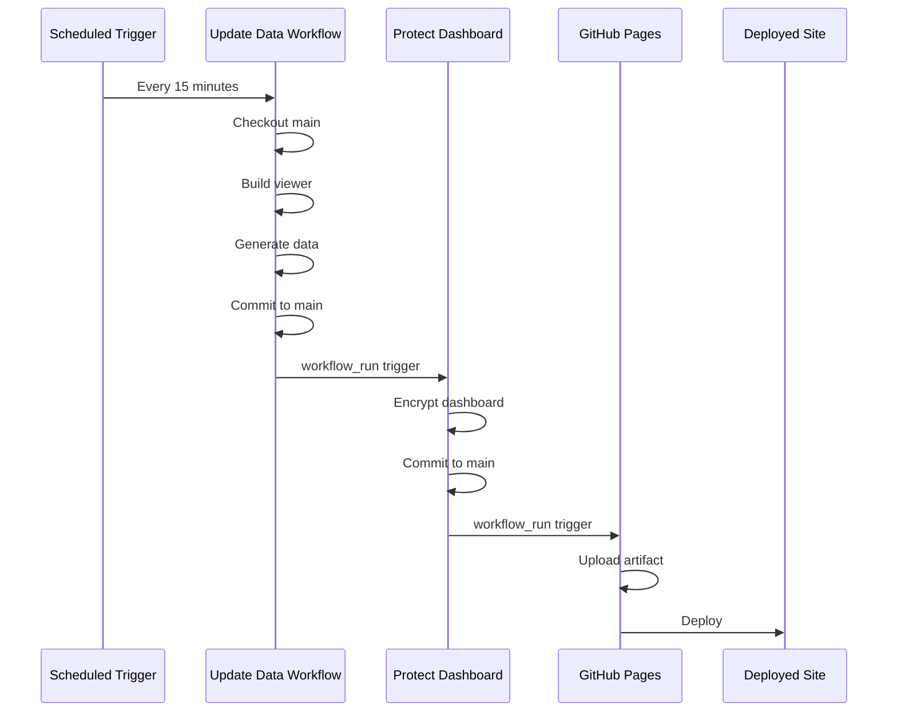
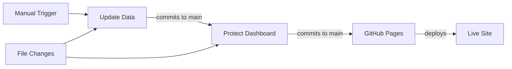

# Documentation Excellence Improvement Plan

**Status:** Reference  
**Date:** 2025-01-18  
**Execution Status:** ✅ Fully executed - All improvements completed

**Note:** This document contains the original improvement plan that has been fully executed. For current documentation maintenance practices, see [DOCS_MAINTENANCE.md](DOCS_MAINTENANCE.md).

← See [DOCUMENTATION_INDEX.md](DOCUMENTATION_INDEX.md) for navigation and canonical sources.

---

## PART A: Findings

### Remaining Inconsistencies

1. **Missing back-links to DOCUMENTATION_INDEX.md**
   - Many reference docs don't link back to the index
   - Historical docs lack navigation back to hub
   - Component READMEs don't reference main documentation

2. **Incomplete status markers**
   - Some historical docs lack clear "HISTORICAL" banners
   - Reference docs don't consistently mark their relationship to canonical sources
   - Component docs don't indicate their scope

3. **Outdated TODO items**
   - SECURITY_FIXES_APPLIED.md contains TODO about package-lock.json (should be resolved or moved to future improvements)

4. **Missing glossary**
   - Terminology defined in multiple places
   - No centralized vocabulary reference
   - Inconsistent usage across docs

### Gaps in Explanations

5. **No visual workflow diagrams**
   - SYSTEM_STATUS.md describes workflows textually but lacks sequence diagrams
   - Workflow chain would benefit from visual representation
   - Missing architecture diagram showing system components

6. **No troubleshooting guide**
   - No "first 10 minutes as a new engineer" guide
   - No common issues and solutions
   - No debugging workflow examples

7. **Missing architecture overview**
   - No SYSTEM_ARCHITECTURE.md explaining overall system design
   - Relationship between retailxai-site and Precipice-2 not clearly diagrammed
   - Component interactions not visualized

8. **Incomplete component documentation**
   - pdfs/README.md and drafts/README.md are minimal
   - dashboard/viewer/README.md lacks troubleshooting and examples
   - No clear component boundaries documented

### Terminology Drift

9. **Inconsistent naming**
   - "Update Data workflow" vs "update_data.yml" vs "Update Data"
   - "Protect Dashboard workflow" vs "protect_dashboard.yml"
   - Some docs use full names, others use file names

10. **Missing context for new engineers**
    - No explanation of why workflows are structured as they are
    - No context on design decisions
    - Historical context scattered

### Weak Transitions

11. **Historical docs not clearly separated**
    - GIT_COMMANDS.md, FINAL_GIT_SYNC_PLAN.md still in root without historical markers
    - Phase diagnostic files (PHASE1-10) in root without clear historical status
    - FIX_PLAN.md, FIXES_APPLIED_SUMMARY.md lack historical markers

12. **Reference docs don't clearly defer**
    - WORKFLOW_SIMULATION.md has note but could be stronger
    - AUDIT_REPORT.md relationship to SYSTEM_STATUS.md could be clearer

---

## PART B: Next-Level Improvements

### High-Value Additions

1. **Create SYSTEM_ARCHITECTURE.md**
   - Visual diagram of system components
   - Relationship between retailxai-site and Precipice-2
   - Data flow diagrams
   - Component interaction diagrams

2. **Add workflow sequence diagrams**
   - Mermaid diagrams in SYSTEM_STATUS.md showing workflow chain
   - Visual representation of Update Data → Protect Dashboard → GitHub Pages flow
   - Decision points and error paths

3. **Create GLOSSARY.md**
   - Centralized terminology definitions
   - Consistent vocabulary across all docs
   - Cross-references to relevant docs

4. **Create QUICK_START.md**
   - "First 10 minutes as a new engineer" guide
   - Quick setup instructions
   - Common troubleshooting scenarios
   - Where to find what information

5. **Create CONTRIBUTING.md**
   - Contribution guidelines
   - Code style standards
   - PR process
   - Testing requirements

6. **Enhance component READMEs**
   - Improve pdfs/README.md and drafts/README.md
   - Add troubleshooting to dashboard/viewer/README.md
   - Add examples and usage patterns

7. **Add status markers to all docs**
   - Clear "Canonical/Reference/Historical" markers
   - Consistent header format
   - Back-links to DOCUMENTATION_INDEX.md

8. **Create troubleshooting section**
   - Common workflow failures and solutions
   - Debugging guide
   - Recovery procedures

---

## PART C: Improvement Plan

### Findings Summary

| Finding | Affected Files | Complexity | Impact | Priority |
|---------|---------------|------------|--------|----------|
| Missing back-links | All reference/historical docs | Low | Medium | High |
| Missing status markers | Historical docs in root | Low | Medium | High |
| TODO items | SECURITY_FIXES_APPLIED.md | Low | Low | Medium |
| Missing glossary | All docs | Medium | High | High |
| Missing diagrams | SYSTEM_STATUS.md | Medium | High | High |
| Missing quick start | New file needed | Medium | High | High |
| Missing architecture doc | New file needed | High | High | Medium |
| Missing contributing guide | New file needed | Medium | Medium | Medium |
| Component docs incomplete | Component READMEs | Low | Low | Low |

### Affected Files

**Files to Update:**
1. SYSTEM_STATUS.md - Add workflow diagrams, improve structure
2. SECURITY_FIXES_APPLIED.md - Remove/resolve TODO
3. All reference docs - Add back-links to DOCUMENTATION_INDEX.md
4. All historical docs - Add historical markers and back-links
5. Component READMEs - Enhance content, add back-links
6. DOCUMENTATION_INDEX.md - Add new files to index

**Files to Create:**
1. GLOSSARY.md - Terminology reference
2. QUICK_START.md - New engineer onboarding
3. SYSTEM_ARCHITECTURE.md - Architecture overview with diagrams
4. CONTRIBUTING.md - Contribution guidelines

**Files to Reorganize:**
1. GIT_COMMANDS.md - Move to docs/history/ or mark historical
2. FINAL_GIT_SYNC_PLAN.md - Mark historical, add back-link
3. FIX_PLAN.md - Mark historical, add back-link
4. FIXES_APPLIED_SUMMARY.md - Mark historical, add back-link
5. Phase diagnostic files - Add historical markers, back-links

### Proposed Fixes

#### Fix 1: Add Back-Links and Status Markers (High Priority)

**Files:** All reference and historical docs
**Changes:**
- Add footer section with "← Back to [DOCUMENTATION_INDEX.md](DOCUMENTATION_INDEX.md)"
- Add clear status markers in headers
- Standardize header format

**Complexity:** Low  
**Impact:** High  
**Execution Order:** 1

#### Fix 2: Create GLOSSARY.md (High Priority)

**File:** New GLOSSARY.md
**Content:**
- All terminology definitions
- Cross-references to relevant docs
- Consistent vocabulary

**Complexity:** Medium  
**Impact:** High  
**Execution Order:** 2

#### Fix 3: Enhance SYSTEM_STATUS.md with Diagrams (High Priority)

**File:** SYSTEM_STATUS.md
**Changes:**
- Add Mermaid workflow sequence diagram
- Add workflow chain visual diagram
- Improve structure with visual aids

**Complexity:** Medium  
**Impact:** High  
**Execution Order:** 3

#### Fix 4: Create QUICK_START.md (High Priority)

**File:** New QUICK_START.md
**Content:**
- First 10 minutes guide
- Quick setup
- Common troubleshooting
- Where to find information

**Complexity:** Medium  
**Impact:** High  
**Execution Order:** 4

#### Fix 5: Resolve TODO Items (Medium Priority)

**File:** SECURITY_FIXES_APPLIED.md
**Changes:**
- Resolve or move TODO about package-lock.json
- Update status if completed

**Complexity:** Low  
**Impact:** Low  
**Execution Order:** 5

#### Fix 6: Create SYSTEM_ARCHITECTURE.md (Medium Priority)

**File:** New SYSTEM_ARCHITECTURE.md
**Content:**
- System component diagram
- Data flow diagrams
- Component interactions
- Relationship to Precipice-2

**Complexity:** High  
**Impact:** High  
**Execution Order:** 6

#### Fix 7: Create CONTRIBUTING.md (Medium Priority)

**File:** New CONTRIBUTING.md
**Content:**
- Contribution guidelines
- Code style
- PR process
- Testing requirements

**Complexity:** Medium  
**Impact:** Medium  
**Execution Order:** 7

#### Fix 8: Enhance Component READMEs (Low Priority)

**Files:** pdfs/README.md, drafts/README.md, dashboard/viewer/README.md
**Changes:**
- Add more context
- Add examples
- Add troubleshooting
- Add back-links

**Complexity:** Low  
**Impact:** Low  
**Execution Order:** 8

#### Fix 9: Mark Historical Docs (High Priority)

**Files:** GIT_COMMANDS.md, FINAL_GIT_SYNC_PLAN.md, FIX_PLAN.md, FIXES_APPLIED_SUMMARY.md, Phase diagnostic files
**Changes:**
- Add historical markers
- Add back-links
- Optionally move to docs/history/

**Complexity:** Low  
**Impact:** Medium  
**Execution Order:** 9

---

## PART D: Execution Prompt

Use this prompt in Cursor to execute the improvements:

---

**CURSOR PROMPT START**

You are refining the retailxai-site documentation to elite internal engineering standard. Apply the following improvements in order:

---

**IMPROVEMENT 1: Add Back-Links and Status Markers**

For each file listed below, add a footer section and ensure proper status markers:

**Files to update:**
- WORKFLOW_SIMULATION.md
- WORKFLOW_CHAIN_SIMULATION.md
- AUDIT_REPORT.md
- SECURITY_FIXES_APPLIED.md
- GITHUB_ACTIONS_PINNED.md
- PHASE9_MONITORING_PLAN.md
- dashboard/viewer/README.md
- docs/mockups.md
- announcement_post.md

**For each file:**
1. Add footer: `---\n\n← Back to [DOCUMENTATION_INDEX.md](DOCUMENTATION_INDEX.md)`
2. Ensure header has clear status marker (Reference/Historical/Canonical)
3. If missing, add note about relationship to canonical sources

**Historical files to mark:**
- GIT_COMMANDS.md - Add historical marker, back-link
- FINAL_GIT_SYNC_PLAN.md - Add historical marker, back-link
- FIX_PLAN.md - Add historical marker, back-link
- FIXES_APPLIED_SUMMARY.md - Add historical marker, back-link
- PHASE1_DIAGNOSTIC.md through PHASE10_FINAL_REPORT.md - Add historical markers, back-links

---

**IMPROVEMENT 2: Create GLOSSARY.md**

Create a new file `GLOSSARY.md` with:

- **Purpose:** Centralized terminology reference
- **Structure:** Alphabetical terms with definitions and cross-references
- **Include terms:**
  - retailxai-site (this GitHub Pages repository)
  - Precipice-2 (private pipeline engine repository)
  - RetailXAI (overall project/product name)
  - Update Data workflow (scheduled data generation)
  - Protect Dashboard workflow (dashboard encryption)
  - GitHub Pages workflow (static site deployment)
  - workflow_run (GitHub Actions trigger type)
  - concurrency (workflow execution control)
  - Staticrypt (dashboard encryption tool)
  - DOMPurify (HTML sanitization library)
  - CSP (Content Security Policy)
  - XSS (Cross-Site Scripting)
  - And other technical terms used across docs

- **Format:** Each term should have definition, context, and links to relevant docs
- **Add footer:** Back-link to DOCUMENTATION_INDEX.md

---

**IMPROVEMENT 3: Enhance SYSTEM_STATUS.md**

Add to SYSTEM_STATUS.md after the "Workflow Chain Flow" section:

1. **Workflow Sequence Diagram** (Mermaid format):

2. **Workflow Chain Visual** (ASCII art or Mermaid flowchart):

3. Add note: "For detailed workflow scenarios, see [WORKFLOW_SIMULATION.md](WORKFLOW_SIMULATION.md)"

---

**IMPROVEMENT 4: Create QUICK_START.md**

Create `QUICK_START.md` with:

**Structure:**
1. **First 10 Minutes**
   - Clone repository
   - Understand structure
   - Key files to know
   - Where to find information

2. **Quick Setup**
   - Prerequisites
   - Local development setup
   - Running workflows locally (if applicable)

3. **Common Tasks**
   - How to update workflows
   - How to add new features
   - How to debug issues

4. **Troubleshooting**
   - Common workflow failures
   - Debugging steps
   - Where to get help

5. **Next Steps**
   - Links to detailed docs
   - Contribution guidelines
   - Architecture overview

**Tone:** Concise, practical, engineer-to-engineer  
**Add footer:** Back-link to DOCUMENTATION_INDEX.md

---

**IMPROVEMENT 5: Resolve TODO in SECURITY_FIXES_APPLIED.md**

In SECURITY_FIXES_APPLIED.md, find the TODO about package-lock.json:

**Option A:** If package-lock.json exists, remove TODO and mark as complete
**Option B:** If it doesn't exist, move TODO to "Future Enhancements" section in SYSTEM_STATUS.md

Update the section to reflect current state.

---

**IMPROVEMENT 6: Create SYSTEM_ARCHITECTURE.md**

Create `SYSTEM_ARCHITECTURE.md` with:

1. **System Overview**
   - High-level architecture diagram (Mermaid)
   - Components and their relationships
   - Data flow

2. **Component Descriptions**
   - retailxai-site (this repo)
   - Precipice-2 (pipeline engine)
   - GitHub Actions workflows
   - Static site components

3. **Data Flow**
   - How data moves from Precipice-2 to retailxai-site
   - How workflows process data
   - How site is deployed

4. **Architecture Decisions**
   - Why workflows are structured as they are
   - Security considerations
   - Design rationale

**Include Mermaid diagrams for:**
- System component diagram
- Data flow diagram
- Workflow interaction diagram

**Add footer:** Back-link to DOCUMENTATION_INDEX.md

---

**IMPROVEMENT 7: Create CONTRIBUTING.md**

Create `CONTRIBUTING.md` with:

1. **Getting Started**
   - Development setup
   - Code style
   - Testing requirements

2. **Making Changes**
   - Branch naming
   - Commit messages
   - PR process

3. **Documentation Standards**
   - When to update docs
   - Documentation style guide
   - Link to DOCS_MAINTENANCE.md

4. **Workflow Changes**
   - How to modify workflows
   - Testing workflow changes
   - Security considerations

**Add footer:** Back-link to DOCUMENTATION_INDEX.md

---

**IMPROVEMENT 8: Enhance Component READMEs**

Update:
- `pdfs/README.md` - Add purpose, usage, file structure
- `drafts/README.md` - Add purpose, usage, file structure
- `dashboard/viewer/README.md` - Add troubleshooting, examples, common issues

For each:
- Add clear purpose statement
- Add usage examples
- Add troubleshooting section
- Add back-link to DOCUMENTATION_INDEX.md

---

**IMPROVEMENT 9: Update DOCUMENTATION_INDEX.md**

Add new files to DOCUMENTATION_INDEX.md:

- GLOSSARY.md - Terminology reference
- QUICK_START.md - New engineer onboarding
- SYSTEM_ARCHITECTURE.md - Architecture overview
- CONTRIBUTING.md - Contribution guidelines

Update "Finding What You Need" section to include:
- "I'm a new engineer" → QUICK_START.md
- "I want to understand system architecture" → SYSTEM_ARCHITECTURE.md
- "I want to contribute" → CONTRIBUTING.md
- "I need term definitions" → GLOSSARY.md

---

**CONSTRAINTS:**

- Do NOT delete any existing information
- Do NOT rewrite entire files unless necessary
- Preserve all historical context
- Keep canonical docs authoritative
- Maintain consistent terminology (use GLOSSARY.md as reference)
- All new files must link back to DOCUMENTATION_INDEX.md
- All updated files must have proper status markers

---

**After completing all improvements:**

1. Verify all files have back-links to DOCUMENTATION_INDEX.md
2. Verify all historical docs are clearly marked
3. Verify terminology is consistent (check against GLOSSARY.md)
4. Verify all new files are added to DOCUMENTATION_INDEX.md
5. Verify no information was lost

---

**CURSOR PROMPT END**

---

## Expected Outcomes

After applying these improvements:

- ✅ All docs have clear status markers and back-links
- ✅ New engineers have clear onboarding path (QUICK_START.md)
- ✅ Terminology is centralized and consistent (GLOSSARY.md)
- ✅ Architecture is clearly documented with diagrams (SYSTEM_ARCHITECTURE.md)
- ✅ Workflows are visualized (SYSTEM_STATUS.md diagrams)
- ✅ Contribution process is documented (CONTRIBUTING.md)
- ✅ All historical docs are properly marked
- ✅ Component docs are enhanced
- ✅ Documentation achieves elite internal engineering standard

---

**Ready for execution.**

