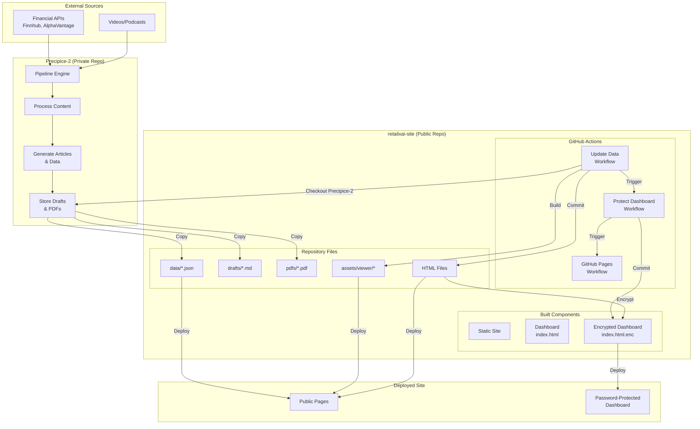

# System Architecture

**Status:** Reference  
**Purpose:** Architecture overview and component relationships

← See [DOCUMENTATION_INDEX.md](DOCUMENTATION_INDEX.md) for navigation and canonical sources.

---

## High-Level Overview

retailxai-site is a static GitHub Pages site that displays articles, drafts, and analytics generated by the Precipice-2 pipeline engine. The system uses GitHub Actions workflows to automatically update data, encrypt the dashboard, and deploy the site.

### System Responsibilities

**retailxai-site (this repository):**
- Static site hosting via GitHub Pages
- Dashboard interface for viewing articles and analytics
- Svelte-based draft viewer
- Automated data updates via GitHub Actions
- Password-protected dashboard encryption

**Precipice-2 (private repository):**
- Pipeline engine that processes videos and generates articles
- Data generation (earnings, trends, costs)
- Article draft creation
- PDF generation

---

## Architecture Diagram

---

## Data Flow

### Article Lifecycle

1. **Ingest** (Precipice-2)
   - Video/podcast uploaded to Precipice-2
   - Pipeline processes content
   - Article draft generated (Markdown)
   - PDF created if applicable

2. **Update Data** (retailxai-site)
   - Scheduled workflow runs every 15 minutes
   - Checks out Precipice-2 repository (assumes `main` branch structure with `data/drafts/`, `data/pdfs/`, `output/drafts/`, `output/pdfs/` directories)
   - Copies drafts and PDFs to `drafts/` and `pdfs/` (handles missing directories gracefully)
   - Generates JSON data files (`data/*.json`) using Python scripts
   - Builds Svelte viewer (`npm ci` then `npm run build`)
   - Commits all changes to `main` branch (only if changes exist)

3. **Protect Dashboard** (retailxai-site)
   - Triggered after Update Data completes
   - Encrypts `dashboard/index.html` using Staticrypt
   - Creates `dashboard/index.html.enc`
   - Commits encrypted file to `main` branch

4. **Deploy** (retailxai-site)
   - Triggered after Protect Dashboard completes
   - Uploads entire repository as artifact
   - Deploys to GitHub Pages
   - Public site and encrypted dashboard go live

### Data Files

**Generated JSON files (`data/*.json`):**
- `articles.json` - Article metadata and status
- `drafts.json` - Draft file listings
- `earnings.json` - Earnings data
- `costs.json` - Cost tracking
- `trends.json` - Trend analysis
- `ticker.json` - Stock ticker data
- `status.json` - System health status

**Source:** Generated by `scripts/generate_data.py` using Precipice-2 data and external APIs.

---

## Component Interactions

### GitHub Actions Workflows

**Update Data (`update_data.yml`):**
- **Triggers:** Schedule (every 15 min), manual, or push to `scripts/**`/`schemas/**`
- **Actions:**
  1. Checkout retailxai-site `main` branch (explicit `ref: main`)
  2. Checkout Precipice-2 `main` branch (explicit `ref: main`, uses `PRECIPICE_TOKEN` secret)
  3. Verify Precipice-2 checkout succeeded
  4. Setup Python 3.11
  5. Copy drafts and PDFs from Precipice-2
  6. Setup Node.js 20
  7. Build Svelte viewer (`npm ci` then `npm run build`)
  8. Generate data JSON files
  9. Commit and push to `main` (explicit `origin main`)
- **Concurrency:** Single run at a time (overlapping runs cancelled)
- **Required Secret:** `PRECIPICE_TOKEN` - See [PRECIPICE_TOKEN_SETUP_GUIDE.md](PRECIPICE_TOKEN_SETUP_GUIDE.md) for setup

**Protect Dashboard (`protect_dashboard.yml`):**
- **Triggers:** On dashboard/asset changes, manual, or after Update Data completes
- **Actions:**
  1. Checkout retailxai-site `main` branch (explicit `ref: main`)
  2. Setup Node.js 20
  3. Install Staticrypt globally
  4. Encrypt `dashboard/index.html`
  5. Commit and push encrypted file to `main` (explicit `origin main`)

**GitHub Pages (`github_pages.yml`):**
- **Triggers:** Push to `main`, manual, or after Protect Dashboard completes
- **Actions:**
  1. Checkout retailxai-site `main` branch (explicit `ref: main`)
  2. Configure Pages environment
  3. Upload entire repository as artifact
  4. Deploy to GitHub Pages

### Svelte Viewer

**Location:** `dashboard/viewer/`

**Build Process:**
- Source: Svelte components in `src/`
- Build output: `assets/viewer/` and `assets/css/viewer.css`
- Build command (workflow): `npm ci` then `npm run build` (runs in Update Data workflow for reproducible builds)
- Build command (local dev): `npm install` then `npm run build` (see [dashboard/viewer/README.md](dashboard/viewer/README.md))
- Dependencies: Managed via `package.json`

**Features:**
- Markdown rendering with syntax highlighting
- PDF preview support
- Collapsible metadata sidebar
- Dark mode compatible

See [dashboard/viewer/README.md](dashboard/viewer/README.md) for details.

---

## Security Architecture

### XSS Protection
- All dynamic HTML sanitized with DOMPurify
- Safe DOM manipulation in JavaScript
- Content Security Policy (CSP) meta tags

### Supply Chain Security
- All GitHub Actions pinned to commit SHAs
- Python dependencies pinned in `requirements.txt`
- NPM dependencies managed via `package-lock.json` (recommended)

### Input Validation
- Article ID validation (alphanumeric, max 100 chars)
- Path traversal prevention
- PDF path regex validation

### Dashboard Protection
- Staticrypt encryption for password protection
- Encrypted file stored as `dashboard/index.html.enc`
- Password managed via GitHub Secrets

See [SYSTEM_STATUS.md](SYSTEM_STATUS.md) → Security Posture for complete details.

---

## Key Design Decisions

**Assumptions Made:**
- Precipice-2 maintains consistent directory structure (`data/drafts/`, `data/pdfs/`, `output/drafts/`, `output/pdfs/`)
- Precipice-2 `main` branch contains the latest processed content
- GitHub Actions has sufficient quota for scheduled runs (every 15 minutes)
- External APIs (Finnhub, AlphaVantage) remain accessible and stable

### Why GitHub Actions?
- Automated updates without manual intervention
- Integration with GitHub Pages deployment
- Free for public repositories
- Version-controlled workflows

### Why Static Site?
- Fast loading times
- Simple deployment via GitHub Pages
- No server maintenance
- Cost-effective hosting

### Why Separate Repositories?
- Precipice-2 contains sensitive pipeline code (private)
- retailxai-site is public-facing (public)
- Clear separation of concerns
- Independent versioning

### Why Workflow Chain?
- Ensures data updates trigger dashboard encryption
- Ensures encryption triggers deployment
- Maintains consistency across updates
- Prevents partial deployments

---

## Related Documentation

- **[SYSTEM_STATUS.md](SYSTEM_STATUS.md)** - Current system state and workflow details
- **[AUDIT_REPORT.md](AUDIT_REPORT.md)** - Deep technical audit
- **[WORKFLOW_SIMULATION.md](WORKFLOW_SIMULATION.md)** - Detailed workflow scenarios
- **[GLOSSARY.md](GLOSSARY.md)** - Terminology reference

---

**Last Updated:** 2025-01-18

