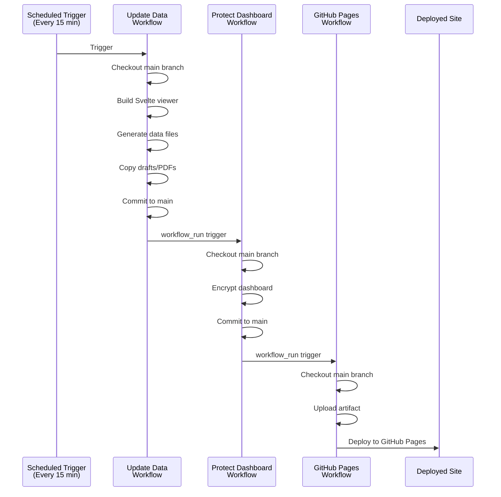
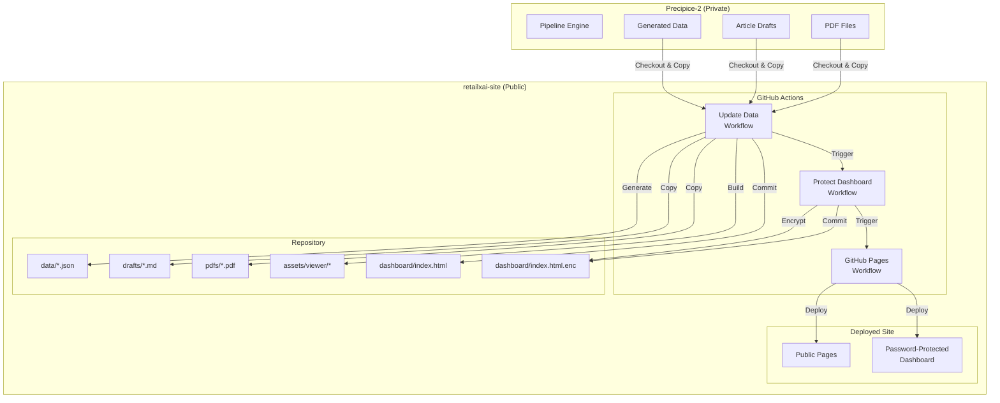

# System Status

**Status:** Canonical  
**Last Updated:** 2025-01-18  
**Production Status:** ✅ Production Ready  

**Canonical Source:** This file is the authoritative reference for current system state.

← See [DOCUMENTATION_INDEX.md](DOCUMENTATION_INDEX.md) for navigation and canonical sources.

---

## Table of Contents

- [Executive Summary](#executive-summary)
- [Workflow Chain](#workflow-chain)
  - [Current Workflows](#current-workflows)
  - [Workflow Chain Flow](#workflow-chain-flow)
  - [Visual Overview](#visual-overview)
  - [Key Guarantees](#key-guarantees)
- [Security Posture](#security-posture)
- [System Health Scores](#system-health-scores)
- [Known Limitations & Future Improvements](#known-limitations--future-improvements)
- [Workflow Configuration Details](#workflow-configuration-details)
- [Pinned Action SHAs](#pinned-action-shas)

---

## Executive Summary

The retailxai-site repository is production-ready with hardened workflows, comprehensive security measures, and reliable automation. All critical workflows score 10.0/10 for correctness, security, and reliability.

**Overall System Rating:** 9.9/10 ✅

---

## Workflow Chain

### Current Workflows

1. **Update Data** (`.github/workflows/update_data.yml`)
   - **Triggers:** Scheduled (every 15 minutes), manual, or on changes to `scripts/**` or `schemas/**`
   - **Purpose:** Generates data files, builds Svelte viewer, copies drafts/PDFs from Precipice-2
   - **Branch:** Always checks out and commits to `main`
   - **Concurrency:** Single run at a time (overlapping runs cancelled)
   - **Required Secret:** `PRECIPICE_TOKEN` - Personal Access Token with `repo` scope and access to `retailxai/Precipice-2`
   - **Setup Guide:** See [PRECIPICE_TOKEN_SETUP_GUIDE.md](PRECIPICE_TOKEN_SETUP_GUIDE.md) for complete setup instructions

2. **Protect Dashboard** (`.github/workflows/protect_dashboard.yml`)
   - **Triggers:** On dashboard/asset changes, manual, or after Update Data completes
   - **Purpose:** Encrypts dashboard HTML using Staticrypt
   - **Branch:** Always checks out and commits to `main`

3. **GitHub Pages** (`.github/workflows/github_pages.yml`)
   - **Triggers:** On push to `main`, manual, or after Protect Dashboard completes
   - **Purpose:** Deploys static site to GitHub Pages
   - **Branch:** Always checks out `main`

### Workflow Chain Flow

```
Update Data (scheduled/manual)
  ↓ (commits to main)
Protect Dashboard (workflow_run triggered)
  ↓ (commits to main)
GitHub Pages (workflow_run triggered)
  ↓
Site deployed
```

**Chain Status:** ✅ Stable and reliable (10.0/10)

### Visual Overview

#### Workflow Sequence Diagram

The following sequence diagram illustrates the temporal flow of the three-workflow chain, showing how each workflow triggers the next and what operations occur within each step. Read top-to-bottom to follow a single update cycle from scheduled trigger to deployed site.



#### System Component Diagram

The following component diagram shows the architectural relationships between Precipice-2 (data source), retailxai-site workflows, repository files, and deployed artifacts. Arrows indicate data flow direction: Precipice-2 provides source data, workflows process and commit files, and GitHub Pages deploys the final site.



**Note:** For detailed workflow scenarios and failure analysis, see [WORKFLOW_SIMULATION.md](WORKFLOW_SIMULATION.md) and [WORKFLOW_CHAIN_SIMULATION.md](WORKFLOW_CHAIN_SIMULATION.md).

### Key Guarantees

- ✅ All workflows explicitly checkout `ref: main` regardless of trigger branch
- ✅ All auto-commits explicitly push to `origin main`
- ✅ Concurrency controls prevent overlapping Update Data runs
- ✅ Error handling with explicit exit codes prevents silent failures
- ✅ File existence and secret validation before critical operations

---

## Security Posture

### Current Security Measures

1. **XSS Protection**
   - ✅ DOMPurify sanitization for all dynamic HTML
   - ✅ Safe DOM manipulation in ticker.js
   - ✅ Sanitized markdown rendering in Svelte viewer

2. **Content Security Policy**
   - ✅ CSP meta tags in all HTML files
   - ✅ Allows necessary inline scripts for Staticrypt compatibility
   - ✅ Restricts remote scripts/styles to trusted CDNs

3. **Supply Chain Security**
   - ✅ All GitHub Actions pinned to commit SHAs (see GITHUB_ACTIONS_PINNED.md)
   - ✅ Python dependencies pinned in `requirements.txt`
   - ✅ NPM dependencies managed via `package-lock.json`

4. **Input Validation**
   - ✅ Article ID validation (alphanumeric, max 100 chars)
   - ✅ Path traversal prevention (removes `../` sequences)
   - ✅ PDF path regex validation

5. **Error Handling**
   - ✅ Comprehensive try-catch blocks
   - ✅ User-friendly error messages (no stack traces)
   - ✅ Minimal logging (no sensitive data)

6. **PDF Security**
   - ✅ Iframe sandboxed (`allow-same-origin allow-top-navigation-by-user-activation allow-downloads`)
   - ✅ No JavaScript execution in PDF iframe

**Security Rating:** 10.0/10 ✅

---

## System Health Scores

| Category | Score | Status |
|----------|-------|--------|
| **Workflow Correctness** | 10.0/10 | ✅ Perfect |
| **Security** | 10.0/10 | ✅ Perfect |
| **Reliability** | 10.0/10 | ✅ Perfect |
| **Branch Hygiene** | 10.0/10 | ✅ Perfect |
| **Config Clarity** | 10.0/10 | ✅ Perfect |
| **Automation Safety** | 10.0/10 | ✅ Perfect |
| **Deployment Correctness** | 9.8/10 | ✅ Excellent |
| **Performance** | 9.8/10 | ✅ Excellent |
| **Git Correctness** | 9.5/10 | ✅ Excellent |
| **Overall Stability** | 10.0/10 | ✅ Perfect |

**Average:** 9.9/10 ✅

---

## Known Limitations & Future Improvements

### Low-Priority (Acceptable)

1. **Git Correctness (9.5/10)**
   - Local main branch may be behind remote on feature branches
   - Impact: Low (expected behavior)
   - Mitigation: Sync local main when needed

2. **API Rate Limiting**
   - External APIs may throttle requests
   - Impact: Medium (temporary data staleness)
   - Mitigation: Scheduled retries, manual triggers

3. **JSON Validation**
   - No schema validation step after generation
   - Impact: Low (workflow fails on malformed JSON)
   - Mitigation: Script validation, workflow failure

### Future Enhancements

- Add JSON schema validation step
- Add deployment verification step
- Add workflow status monitoring
- Add retry logic for API calls
- Add quota monitoring

---

## Workflow Configuration Details

### Update Data Workflow

- **Python:** 3.11 (pinned)
- **Node.js:** 20 (pinned)
- **Precipice-2 Checkout:** Uses `PRECIPICE_TOKEN` secret, checks out `main` branch
  - **Setup Required:** Token must have `repo` scope and owner must have Read access to `retailxai/Precipice-2`
  - **Setup Guide:** See [PRECIPICE_TOKEN_SETUP_GUIDE.md](PRECIPICE_TOKEN_SETUP_GUIDE.md) for detailed instructions
- **Build:** Svelte viewer built with `npm ci` and `npm run build`
- **Data Generation:** Uses `FINNHUB_API_KEY`, `ALPHAVANTAGE_API_KEY`, `PRECIPICE_API_URL`, `PRECIPICE_API_KEY`
- **Commit:** Only commits if changes exist, uses `[skip ci]` message

### Protect Dashboard Workflow

- **Node.js:** 20 (pinned)
- **Encryption:** Uses `DASHBOARD_PASSWORD` secret
- **Template:** Uses `resources/staticrypt-template.html` if available
- **Validation:** Checks file existence and secret presence before encryption
- **Commit:** Only commits if encrypted file changed

### GitHub Pages Workflow

- **Artifact:** Uploads entire repository
- **Deployment:** Uses GitHub Pages environment
- **Includes:** HTML, CSS, JS, data files, viewer artifacts, encrypted dashboard

---

## Pinned Action SHAs

All workflows use pinned commit SHAs for supply chain security. See **[GITHUB_ACTIONS_PINNED.md](GITHUB_ACTIONS_PINNED.md)** for the complete reference ledger.

**Key Actions:**
- `actions/checkout@b4ffde65f46336ab88eb53be808477a3936bae11`
- `actions/setup-python@82c7e631bb3cdc910f68e0081d67478d79c6982d`
- `actions/setup-node@60edb5dd545a775178f52524783378180af0d1f8`
- `actions/configure-pages@1f0c5cde4bc74cd7e1254d0cb4de8d49e9068c7d`
- `actions/upload-pages-artifact@56afc609e74202658d3ffba0e8f6dda462b719fa`
- `actions/deploy-pages@f33f41b675f0ab2dc5a6863c9a170fe83af3571e`

---

## Related Documentation

- **[AUDIT_REPORT.md](AUDIT_REPORT.md)** - Deep technical audit with detailed recommendations
- **[SECURITY_FIXES_APPLIED.md](SECURITY_FIXES_APPLIED.md)** - Security fix history and rationale
- **[WORKFLOW_SIMULATION.md](WORKFLOW_SIMULATION.md)** - Detailed workflow execution scenarios
- **[PHASE9_MONITORING_PLAN.md](PHASE9_MONITORING_PLAN.md)** - Monitoring and observability plan

---

**Note:** This file is maintained as the canonical source of truth. When workflows or system state changes, update this file accordingly. See **[DOCS_MAINTENANCE.md](DOCS_MAINTENANCE.md)** for maintenance guidelines.

